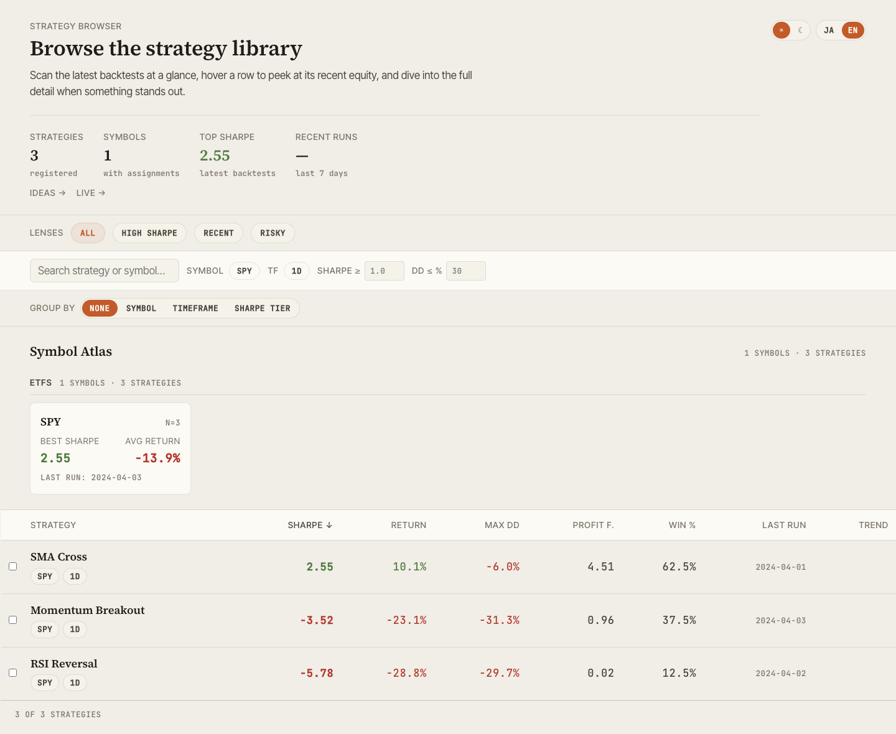
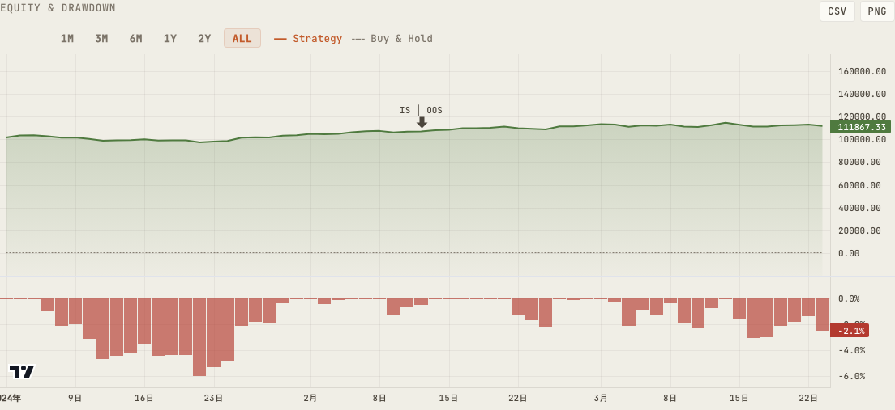
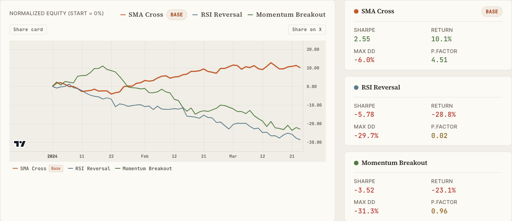
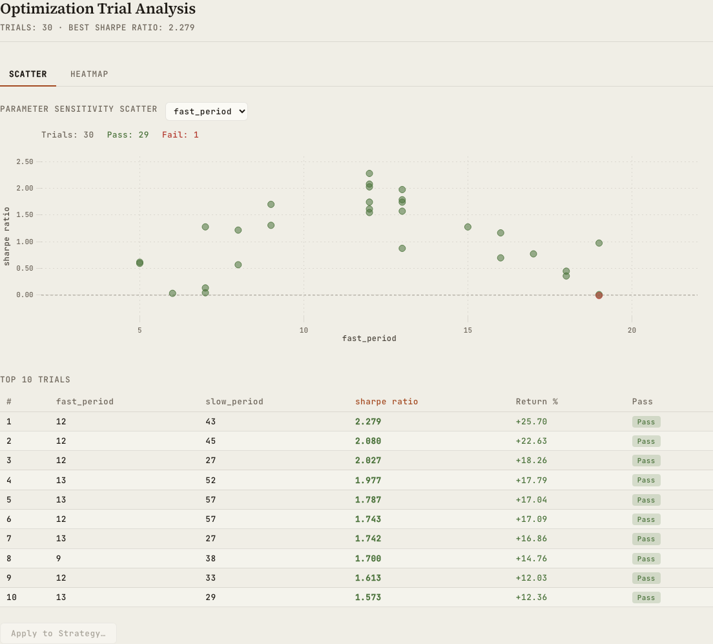
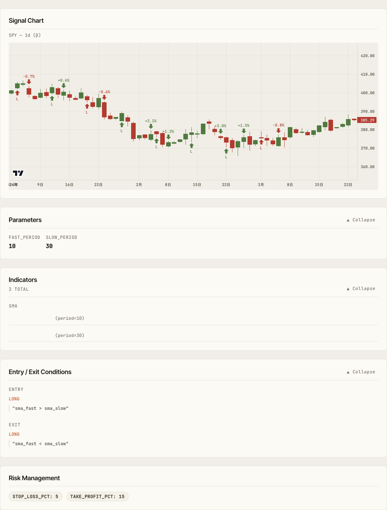

# alpha-visualizer

[](https://pypi.org/project/alpha-visualizer/)
[](https://github.com/alforge-labs/alpha-visualizer/actions/workflows/ci.yml)
[](https://pypi.org/project/alpha-visualizer/)
[](LICENSE)

**English** | [日本語](README.md)

> **A standalone web visualization tool for AlphaForge backtest results**

`alpha-visualizer` reads `backtest_results.db` (SQLite) and strategy JSON files produced by the [AlphaForge](https://alforgelabs.com/) backtest engine and serves a browser-based dashboard. A single `alpha-vis serve` command launches a FastAPI + React SPA that lets you browse strategies, compare metrics, inspect optimization results, and reconcile live trading against backtests.

> **Breaking change in 0.3.0**: The CLI command was renamed from `vis` to `alpha-vis`. Plain `vis` collided with macOS BSD `vis(1)` (text visibility utility), so beginners hit `vis: serve: No such file or directory` when trying the legacy `vis serve` command. See [CHANGELOG](CHANGELOG.md).



## Features

- **Browse** — Strategy library with search (Symbol Atlas / Saved Views / Strategy Ledger)
- **Detail** — Equity / Drawdown / trade history with benchmark metrics (alpha / beta / IR / Correlation)
- **Compare** — Side-by-side metrics and correlation heatmap across strategies
- **Optimize** — Walk-Forward composite equity curves and Grid optimization results
- **Live** — Period-aligned diff between backtest and live execution
- **Ideas** — Exploration idea board with status / tag filters
- **Theme & i18n** — Dark/Light modes, English/Japanese UI toggle
- **Export & share** — CSV / PNG export, URL-based state sharing for Browse

## Quick Start

### Install

```bash
# uv (recommended)
uv pip install alpha-visualizer

# pip
pip install alpha-visualizer
```

### Run

```bash
# From your AlphaForge working directory (where backtest_results.db / strategies/ live)
alpha-vis serve

# Or specify the directory explicitly
alpha-vis serve --forge-dir /path/to/alpha-strategies

# Custom port / host
alpha-vis serve --port 9000 --host 0.0.0.0

# Don't open the browser automatically
alpha-vis serve --no-open
```

The browser opens **http://127.0.0.1:8000**. Press `Ctrl+C` to stop.

### Environment Variables

| Variable | Role |
|---|---|
| `FORGE_CONFIG` | Absolute path to `forge.yaml`. **Takes precedence over `--forge-dir`** (search order: explicit `config_path` arg → `FORGE_CONFIG` → `<forge_dir>/forge.yaml`) |
| `VITE_API_PROXY` | API proxy target for the frontend dev server (default `http://127.0.0.1:8000`) |

If `alpha-vis serve --forge-dir /path/to/A` seems to be reading a different DB than expected, this environment variable is almost always the cause. Run `unset FORGE_CONFIG` to clear it.

## Screenshots

| Detail | Compare |
|---|---|
|  |  |

| Optimize | Strategy structure |
|---|---|
|  |  |

## Documentation

- **Official docs**: <https://alforgelabs.com/en/docs/alpha-visualizer/>
- **Contributing**: [CONTRIBUTING.en.md](CONTRIBUTING.en.md)
- **Security**: [SECURITY.en.md](SECURITY.en.md)
- **Code of Conduct**: [CODE_OF_CONDUCT.en.md](CODE_OF_CONDUCT.en.md) (Contributor Covenant v2.1)
- **Changelog**: [CHANGELOG.md](CHANGELOG.md)
- **Third-party licenses**: [THIRDPARTY_LICENSES.txt](THIRDPARTY_LICENSES.txt)

## Related Projects

- [Alforge Labs](https://alforgelabs.com/) — AlphaForge official site & tutorials
- [AlphaForge](https://alforgelabs.com/en/docs/) — Backtest engine (commercial license)

## Development

```bash
# Install dependencies
uv sync

# Tests & lint
uv run pytest tests/ -v
uv run ruff check src/ tests/

# Frontend dev server (hot reload)
cd frontend && pnpm install && pnpm run dev

# Frontend production build (outputs to src/alpha_visualizer/static/)
cd frontend && pnpm install && pnpm run build
```

See [CONTRIBUTING.en.md](CONTRIBUTING.en.md) for details.

## License

[Apache License 2.0](LICENSE) © [alforge-labs](https://github.com/alforge-labs)
