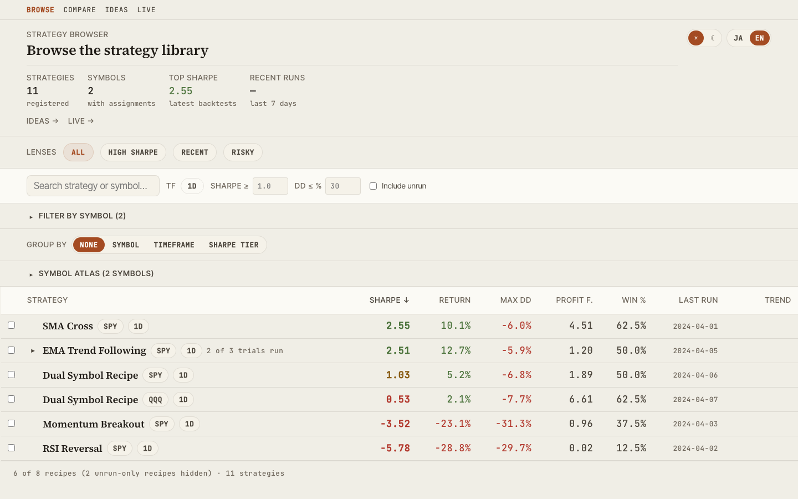
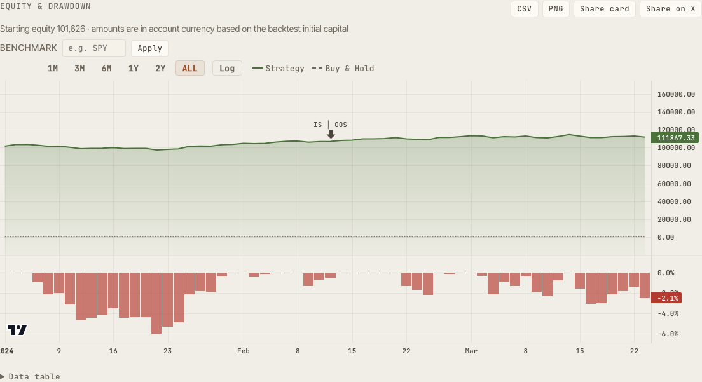
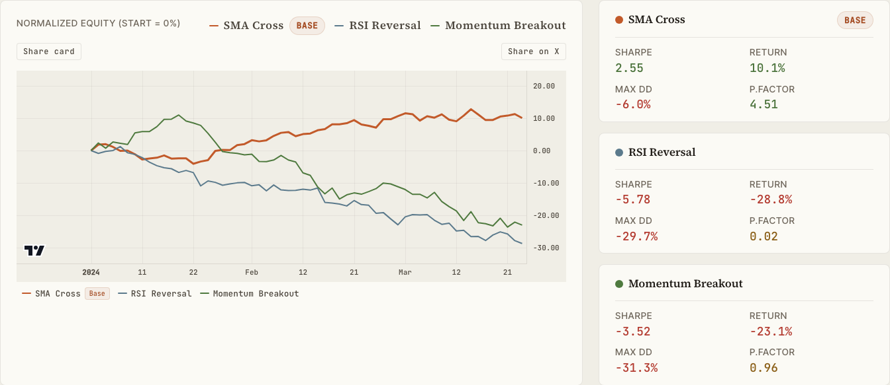
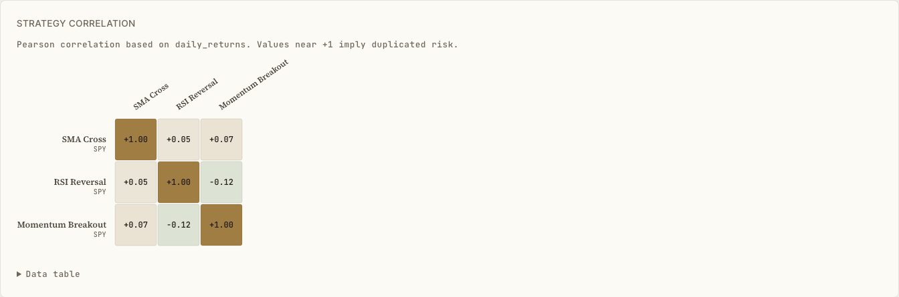
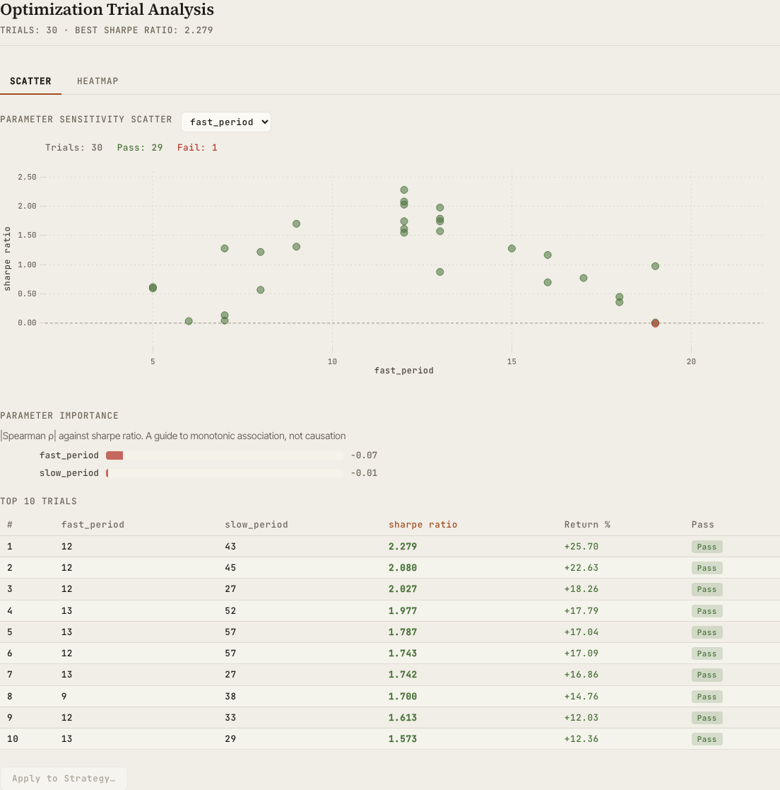
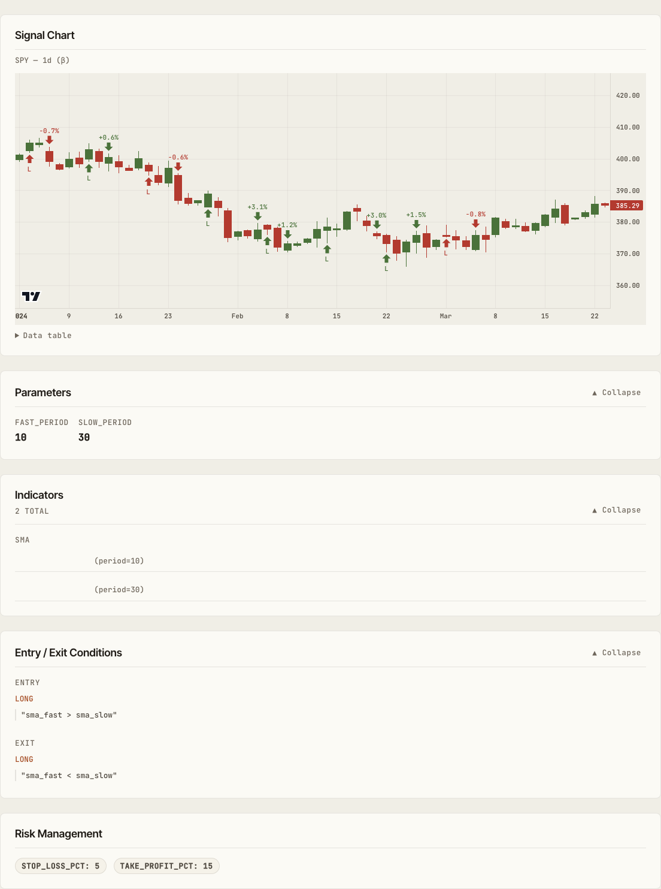
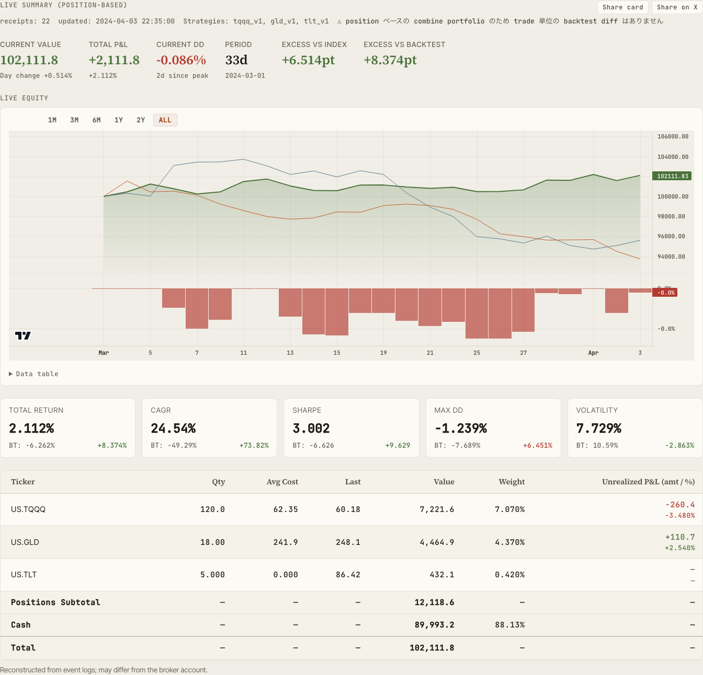
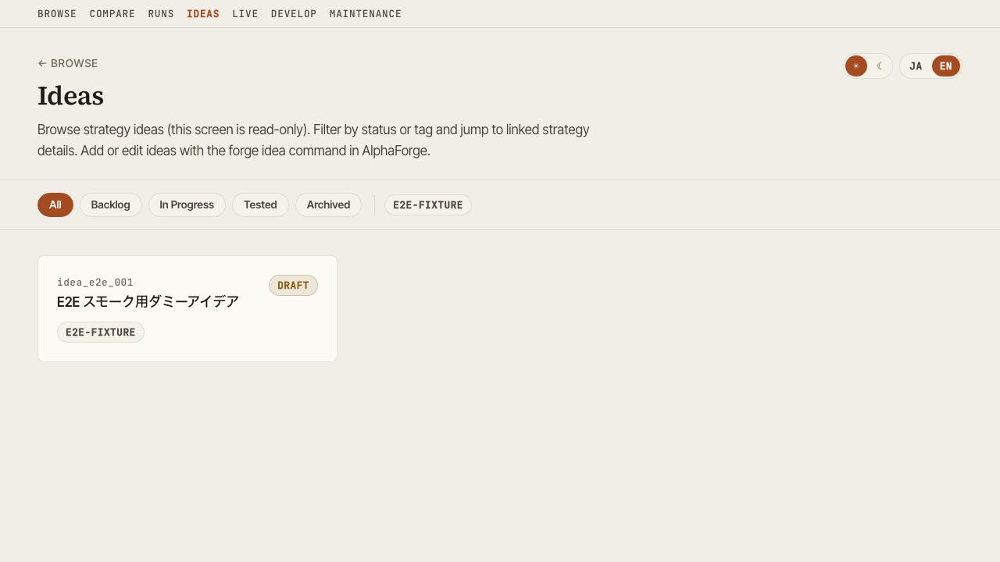
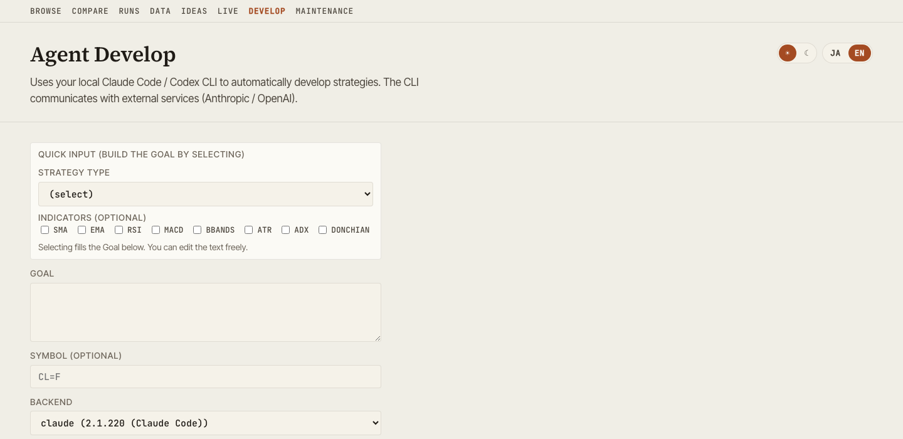

# alpha-visualizer

[](https://pypi.org/project/alpha-visualizer/)
[](https://github.com/alforge-labs/alpha-visualizer/actions/workflows/ci.yml)
[](https://pypi.org/project/alpha-visualizer/)
[](LICENSE)
[](https://x.com/Alforge_bot)

**English** | [日本語](README.md)

> **A standalone web visualization tool for [AlphaForge](https://alforgelabs.com) backtest results** — the agent-native quant CLI: write strategies in JSON, optimize with Optuna TPE, validate with walk-forward, and export to TradingView Pine v6. Your AI agent can drive the whole pipeline. → **[Try AlphaForge free](https://alforgelabs.com)**

`alpha-visualizer` reads `backtest_results.db` (SQLite) and strategy JSON files produced by the [AlphaForge](https://alforgelabs.com/) backtest engine and serves a browser-based dashboard. A single `alpha-vis serve` command launches a FastAPI + React SPA that lets you browse strategies, compare metrics, inspect optimization results, and reconcile live trading against backtests.

> **Breaking change in 0.3.0**: The CLI command was renamed from `vis` to `alpha-vis`. Plain `vis` collided with macOS BSD `vis(1)` (text visibility utility), so beginners hit `vis: serve: No such file or directory` when trying the legacy `vis serve` command. See [CHANGELOG](CHANGELOG.md).



## Features

- **Browse** — Strategy library with search (Symbol Coverage / Saved Views / Strategy Ledger)
- **Detail** — Equity / Drawdown / trade history with benchmark metrics (alpha / beta / IR / Correlation), plus TradingView Pine Script (v6) generation, preview and download (paid plans)
- **Compare** — Side-by-side metrics and correlation heatmap across strategies
- **Optimize** — Walk-Forward composite equity curves and Grid optimization results
- **Live** — Period-aligned diff between backtest and live execution
- **Ideas** — Exploration idea board with status / tag filters
- **Data** — Historical data inventory with freshness display (stale badges), plus GUI-based fetching and bulk incremental updates (with progress and cancellation)
- **Maintenance** — List and selectively delete orphan backtest results (results with no matching strategy definition in strategies.db)
- **Develop (Agent Develop)** — Enter a goal and your local Claude Code / Codex CLI develops a strategy automatically (see below)
- **Theme & i18n** — Dark/Light modes, English/Japanese UI toggle
- **Export & share** — CSV / PNG export, social share card (OGP-sized PNG with equity curve + headline metrics), URL-based state sharing for Browse

## Quick Start

### Install

```bash
# uv (recommended)
uv pip install alpha-visualizer

# pip
pip install alpha-visualizer
```

### Try the bundled samples first (no AlphaForge required)

Even without AlphaForge, you can explore every screen with the bundled synthetic sample data — one command:

```bash
alpha-vis serve --use-bundled-samples
```

This opens a self-contained forge project with 40 backtest results, WFO / Grid optimization runs, and strategy ideas (fully synthetic data, free to redistribute). See [samples/README.en.md](samples/README.en.md) for details.

### Run

```bash
# From your AlphaForge working directory (where backtest_results.db / strategies/ live)
alpha-vis serve

# Or specify the directory explicitly
alpha-vis serve --forge-dir /path/to/alpha-strategies

# Custom port / host
alpha-vis serve --port 9000 --host 0.0.0.0

# Don't open the browser automatically
alpha-vis serve --no-open
```

The browser opens **http://127.0.0.1:8000**. Press `Ctrl+C` to stop.

### Environment Variables

| Variable | Role |
|---|---|
| `FORGE_CONFIG` | Absolute path to `forge.yaml`. **Takes precedence over `--forge-dir`** (search order: explicit `config_path` arg → `FORGE_CONFIG` → `<forge_dir>/forge.yaml`) |
| `VITE_API_PROXY` | API proxy target for the frontend dev server (default `http://127.0.0.1:8000`) |
| `ALPHA_VIS_RUN_TIMEOUT` | Timeout in seconds for the forge CLI invoked by `POST /api/run` (re-run backtest); default `600` |
| `ALPHA_VIS_JOB_TIMEOUT` | Timeout in seconds for async jobs (`POST /api/jobs`: optimize / WFT / backtest); default `3600` |
| `ALPHA_VIS_JOB_CONCURRENCY` | Max concurrent async jobs (default `1`; the backtest engine is CPU-bound, so raise with care) |

If `alpha-vis serve --forge-dir /path/to/A` seems to be reading a different DB than expected, this environment variable is almost always the cause. Run `unset FORGE_CONFIG` to clear it.

## AI Strategy Development (Agent Develop)

The GUI's "Develop" view (`/develop`) lets you enter a free-text goal, an optional target symbol, and a backend (Claude Code / Codex CLI). It then launches your locally installed `claude` / `codex` CLI headlessly to automatically: create a strategy JSON, validate it with `alpha-forge backtest run`, and show a link to the new strategy once it's done.

> **⚠️ About external communication**: This feature launches your own `claude` / `codex` CLI as-is. Those CLIs communicate with Anthropic / OpenAI. alpha-visualizer itself never handles, stores, or transmits API keys.

**Permission model**

- The claude backend is constrained to the forge workspace via a tool allowlist (`--permission-mode dontAsk` + `--allowedTools "Read(//<workspace>/**),Edit(//<workspace>/**),Glob,Grep,Bash(alpha-forge *)"`), a fixed working directory, and prompt instructions. File reads and writes are scoped to paths under the workspace, and anything outside is denied automatically (the `Edit` rule covers all file-editing tools, including Write). Note that this is the CLI's own permission check, not an OS-level sandbox. The codex backend, by contrast, restricts file access via `--sandbox workspace-write`, which is an OS-level sandbox
- The only shell command allowed is `alpha-forge`. Processes the agent starts inherit `FORGE_NONINTERACTIVE=1`, so alpha-forge's confirmation prompts for destructive operations are auto-confirmed — an accepted trade-off given that those operations stay inside the workspace
- If the server is bound to a non-loopback address (e.g. `alpha-vis serve --host 0.0.0.0`), this feature is disabled entirely, so it can't be used to run arbitrary-code-like operations over the LAN

**Prerequisites**

- `claude` (Claude Code) or `codex` (Codex CLI) must be on `PATH` and already authenticated
- `alpha-forge` must be installed
- **Known limitation of the codex backend**: `--sandbox workspace-write` blocks network access, so it cannot fetch price data for a symbol that isn't already cached (observed: it fails at DNS resolution). Run a backtest for the target symbol once beforehand to cache the data, or use the claude backend instead (claude restricts what tools the agent can run, but doesn't block the alpha-forge CLI's own network access)

**Environment Variable**

| Variable | Role |
|---|---|
| `ALPHA_VIS_AGENT_TIMEOUT` | Timeout in seconds for an agent job (default `1800`). On timeout, the whole process tree is killed and the job is marked failed |
| `ALPHA_VIS_AGENT_MAX_TURNS` | Default turn limit (default `100`, claude only). The Develop view's "Turn limit" field overrides it per run (max `500`) |

**About the turn limit**

The claude backend stops as soon as it reaches its turn limit (`--max-turns`), even in the middle of the work. The default is `100`, chosen so it roughly matches the timeout (1800 s by default) — measurements put one turn at about 17 seconds. Exploratory goals that re-run backtests many times can hit the limit, so either raise "Turn limit (optional)" in the Develop view for that run, or split the goal into smaller steps. When a run is cut off this way the error message says so explicitly, and whatever the agent created so far stays in the workspace.

## Screenshots

| Detail | Compare |
|---|---|
|  |  |

**Compare — Strategy correlation heatmap**



| Optimize | Strategy structure |
|---|---|
|  |  |

| Live (backtest vs. live diff) | Ideas (exploration board) |
|---|---|
|  |  |

**Develop — AI strategy development**



## Troubleshooting

Answers to common issues — `alpha-vis: command not found`, missing `backtest_results.db`, port conflicts — are collected in the official FAQ.

- **FAQ & Troubleshooting**: <https://alforgelabs.com/en/docs/alpha-visualizer/faq/>
- Still stuck? Open a [GitHub Issue](https://github.com/alforge-labs/alpha-visualizer/issues)

## Documentation

- **Official docs**: <https://alforgelabs.com/en/docs/alpha-visualizer/>
- **Contributing**: [CONTRIBUTING.en.md](CONTRIBUTING.en.md)
- **Security**: [SECURITY.en.md](SECURITY.en.md)
- **Code of Conduct**: [CODE_OF_CONDUCT.en.md](CODE_OF_CONDUCT.en.md) (Contributor Covenant v2.1)
- **Changelog**: [CHANGELOG.md](CHANGELOG.md)
- **Third-party licenses**: [THIRDPARTY_LICENSES.txt](THIRDPARTY_LICENSES.txt)

## Related Projects

- [Alforge Labs](https://alforgelabs.com/) — AlphaForge official site & tutorials
- [AlphaForge](https://alforgelabs.com/en/docs/) — Backtest engine (commercial license)

## Development

```bash
# Install dependencies
uv sync

# Tests & lint
uv run pytest tests/ -v
uv run ruff check src/ tests/

# Frontend dev server (hot reload)
cd frontend && pnpm install && pnpm run dev

# Frontend production build (outputs to src/alpha_visualizer/static/)
cd frontend && pnpm install && pnpm run build
```

See [CONTRIBUTING.en.md](CONTRIBUTING.en.md) for details.

## License

[Apache License 2.0](LICENSE) © [alforge-labs](https://github.com/alforge-labs)
