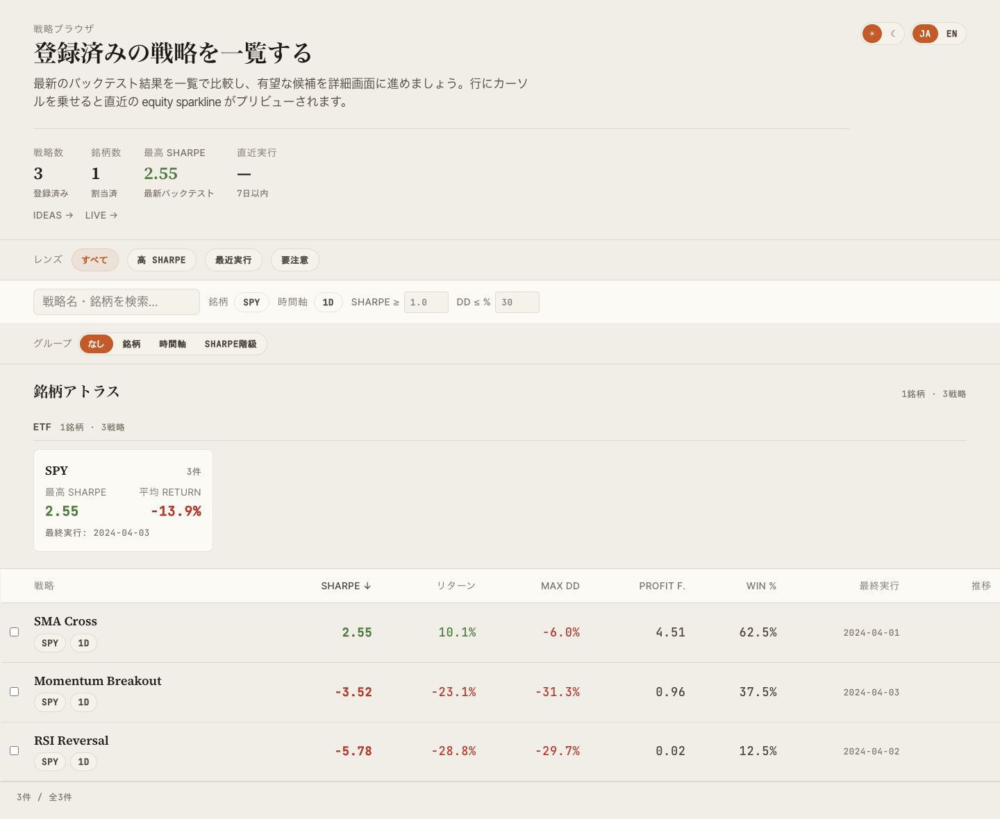
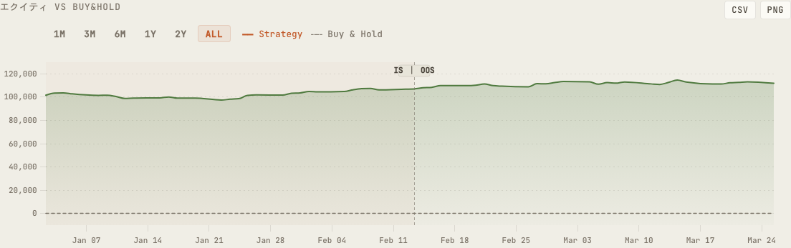
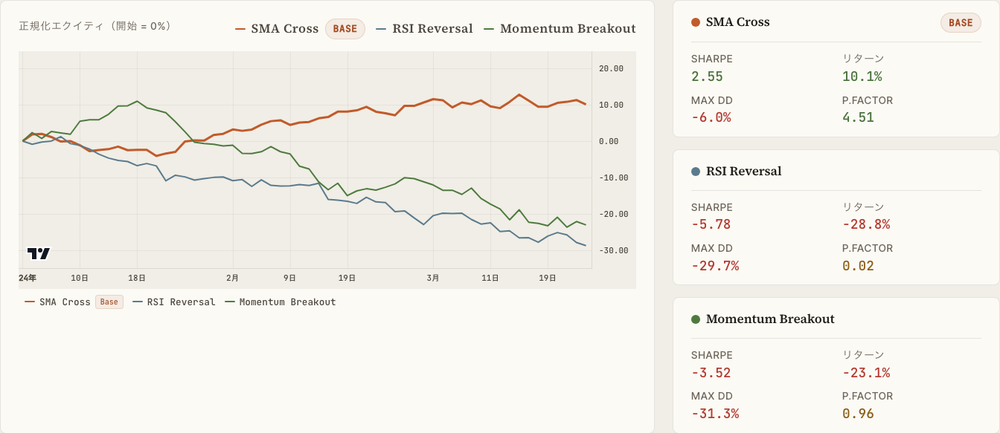
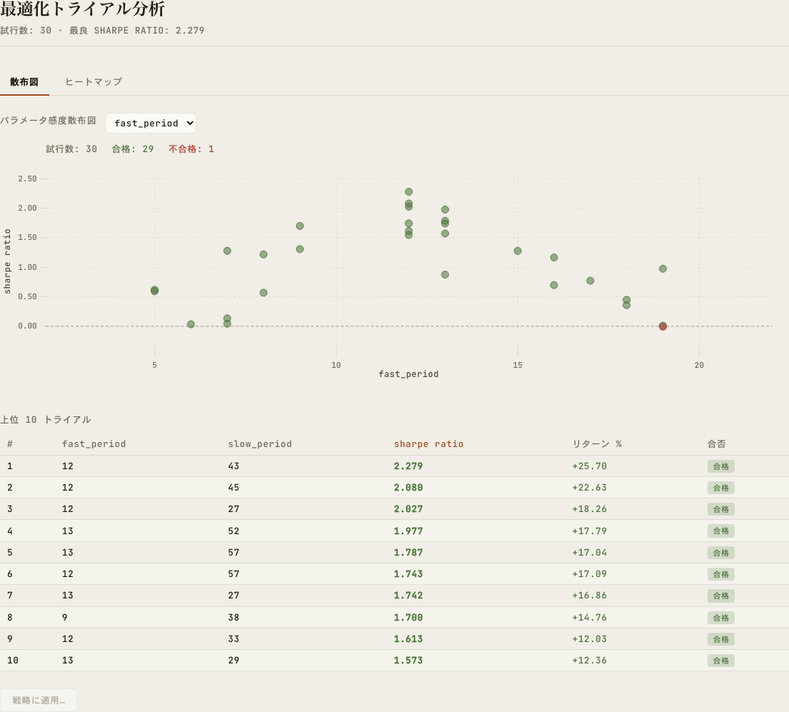
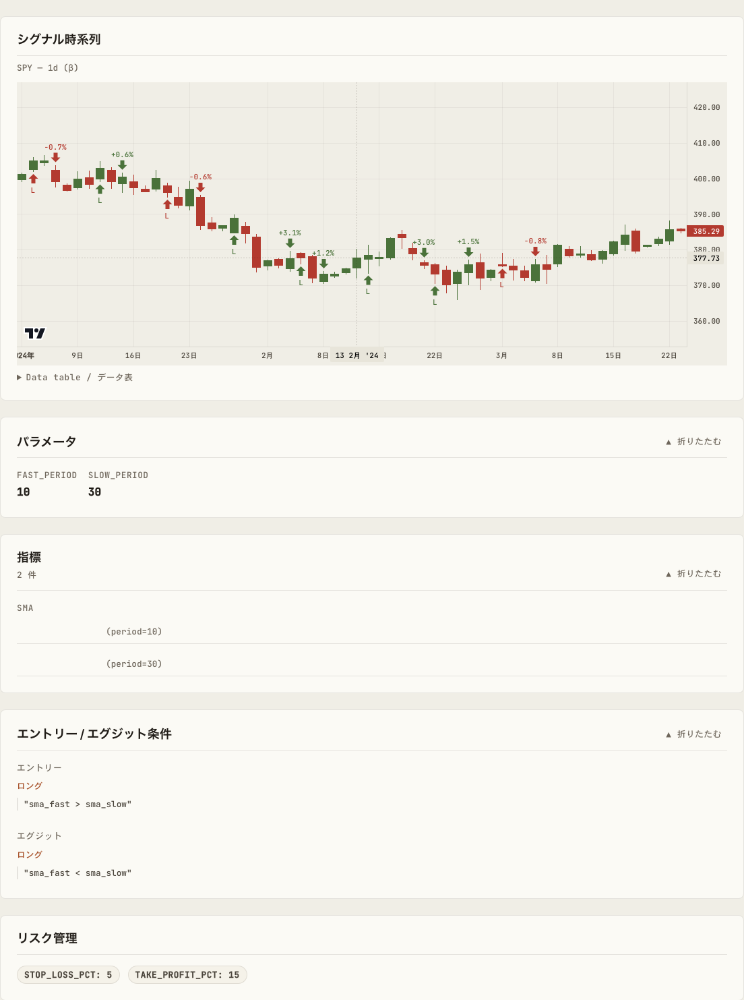

# alpha-visualizer

[](https://pypi.org/project/alpha-visualizer/)
[](https://github.com/alforge-labs/alpha-visualizer/actions/workflows/ci.yml)
[](https://pypi.org/project/alpha-visualizer/)
[](LICENSE)

[English](README.en.md) | **日本語**

> **AlphaForge バックテスト結果を Web ブラウザで可視化するスタンドアロンツール**

`alpha-visualizer` は、[AlphaForge](https://alforgelabs.com/) のバックテストエンジンが出力する `backtest_results.db`（SQLite）と戦略 JSON を直接読み取り、ブラウザベースのダッシュボードとして可視化します。`alpha-vis serve` 一発で FastAPI + React SPA が起動し、戦略の閲覧・比較・最適化結果の確認・ライブ実績との突き合わせまでを行えます。

> **0.3.0 で破壊的変更**: コマンド名を `vis` → `alpha-vis` にリネームしました。macOS 標準の `/usr/bin/vis`（BSD 系テキスト可視化ユーティリティ）と衝突して、旧 `vis serve` コマンドが `vis: serve: No such file or directory` などになる初学者の詰まりを解消するためです。詳細は [CHANGELOG](CHANGELOG.md) を参照してください。



## 主な機能

- **Browse** — 戦略ライブラリの一覧と検索（Symbol Atlas / Saved Views / Strategy Ledger）
- **Detail** — Equity / Drawdown / 取引履歴・ベンチマーク（alpha / beta / IR / Correlation）
- **Compare** — 複数戦略の指標比較と相関ヒートマップ
- **Optimize** — WFO 合成エクイティカーブ・Grid 最適化結果の可視化
- **Live** — バックテストとライブ実績の期間整合 diff
- **Ideas** — 探索アイデアの一覧（ステータス・タグフィルタ）
- **テーマ切替** — ダーク/ライトモード、日英バイリンガル UI
- **エクスポート** — CSV / PNG エクスポート、URL 共有（Browse の selectedId / compareIds 同期）

## クイックスタート

### インストール

```bash
# uv（推奨）
uv pip install alpha-visualizer

# pip
pip install alpha-visualizer
```

### 起動

```bash
# AlphaForge の作業ディレクトリで（backtest_results.db / strategies/ がある場所）
alpha-vis serve

# パスを明示する場合
alpha-vis serve --forge-dir /path/to/alpha-strategies

# ポート・ホスト指定
alpha-vis serve --port 9000 --host 0.0.0.0

# ブラウザを自動で開かない
alpha-vis serve --no-open
```

ブラウザで **http://127.0.0.1:8000** が開きます。`Ctrl+C` で停止します。

### 環境変数

| 変数名 | 役割 |
|---|---|
| `FORGE_CONFIG` | `forge.yaml` への絶対パス。**`--forge-dir` 引数より優先される**（探索順序: 引数 `config_path` → `FORGE_CONFIG` → `<forge_dir>/forge.yaml`） |
| `VITE_API_PROXY` | フロント開発サーバーの API proxy 先（既定 `http://127.0.0.1:8000`） |

開発時に予期せぬ `forge.yaml` が参照されている場合は `unset FORGE_CONFIG` で解除してください。手元で `alpha-vis serve --forge-dir /path/to/A` を打ったのに別ディレクトリの DB が読まれているときは、ほぼこの環境変数が原因です。

## スクリーンショット

| Detail | Compare |
|---|---|
|  |  |

| Optimize | Strategy 構造 |
|---|---|
|  |  |

## ドキュメント

- **公式ドキュメント**: <https://alforgelabs.com/ja/docs/alpha-visualizer/>
- **開発に参加**: [CONTRIBUTING.md](CONTRIBUTING.md)
- **セキュリティ報告**: [SECURITY.md](SECURITY.md)
- **行動規範**: [CODE_OF_CONDUCT.md](CODE_OF_CONDUCT.md)（Contributor Covenant v2.1）
- **変更履歴**: [CHANGELOG.md](CHANGELOG.md)
- **サードパーティライセンス**: [THIRDPARTY_LICENSES.txt](THIRDPARTY_LICENSES.txt)

## 関連プロジェクト

- [Alforge Labs](https://alforgelabs.com/) — AlphaForge 公式サイト・チュートリアル
- [AlphaForge](https://alforgelabs.com/ja/docs/) — バックテストエンジン本体（商用ライセンス）

## 開発環境

```bash
# 依存関係インストール
uv sync

# テスト・Lint
uv run pytest tests/ -v
uv run ruff check src/ tests/

# フロントエンド開発サーバー（ホットリロード）
cd frontend && pnpm install && pnpm run dev

# フロントエンドビルド（src/alpha_visualizer/static/ に出力）
cd frontend && pnpm run build
```

詳細は [CONTRIBUTING.md](CONTRIBUTING.md) を参照してください。

## ライセンス

[MIT License](LICENSE) © [alforge-labs](https://github.com/alforge-labs)
