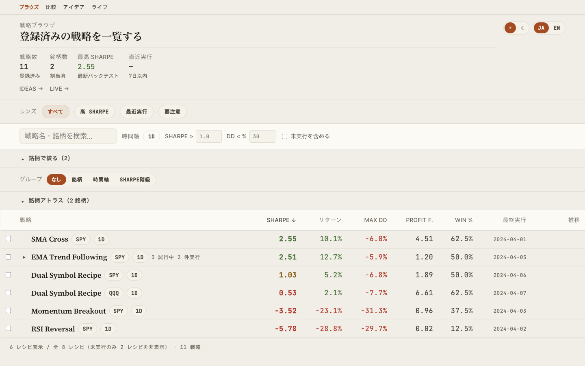
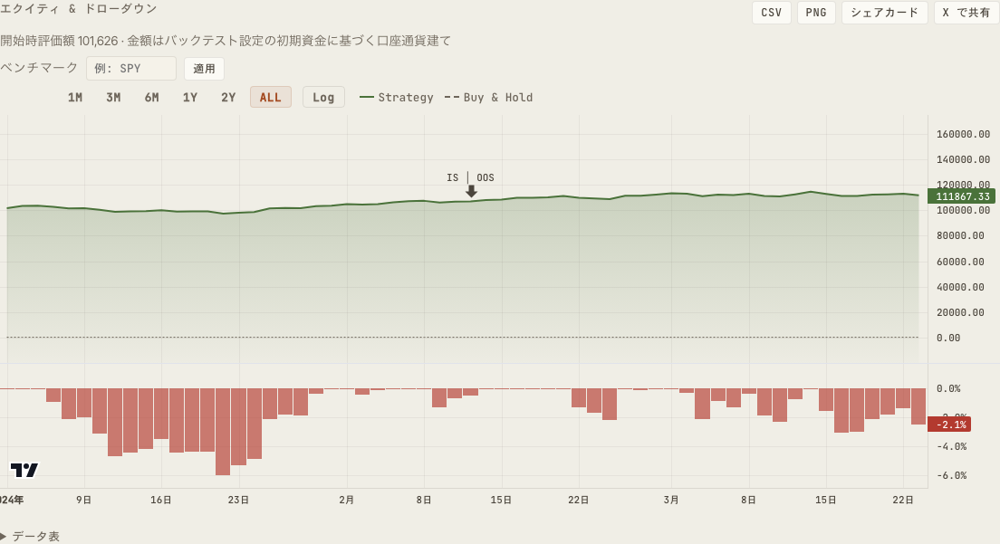
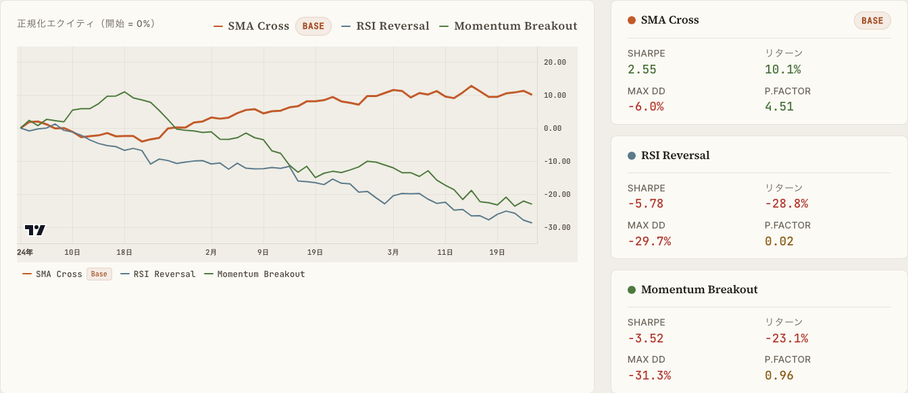
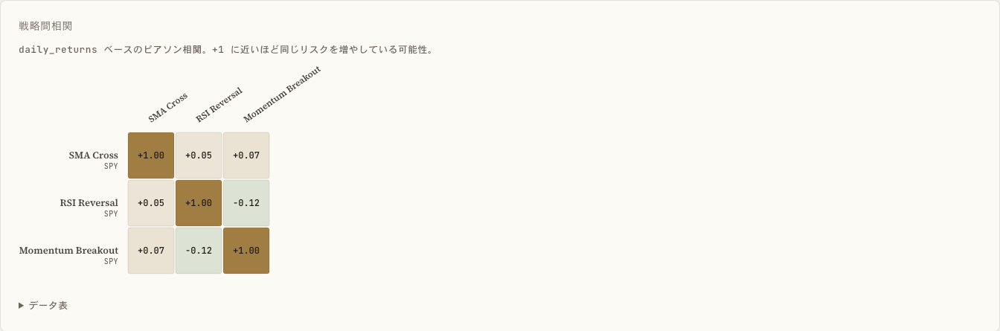
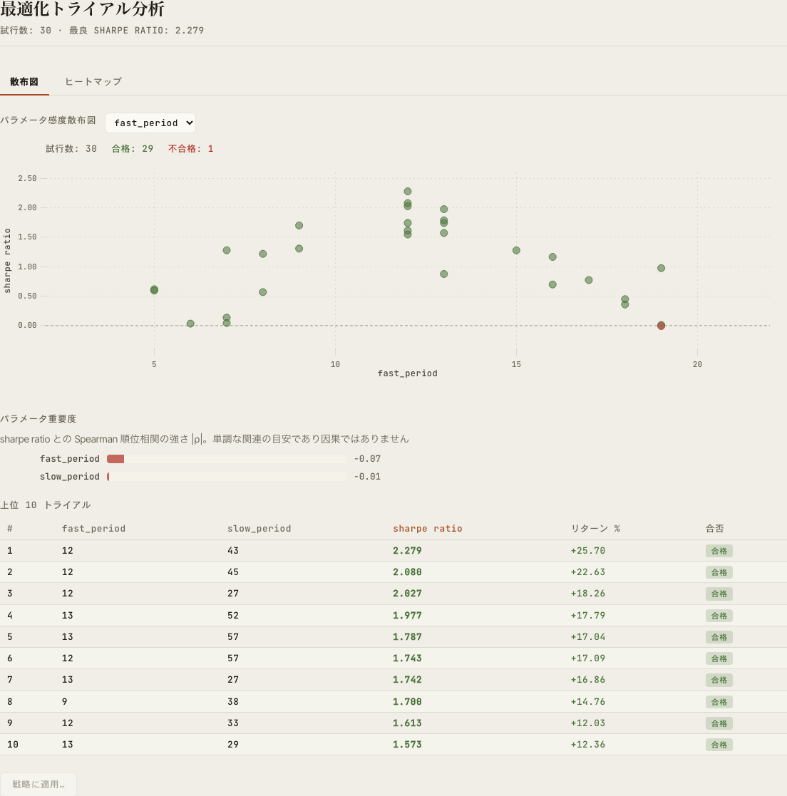
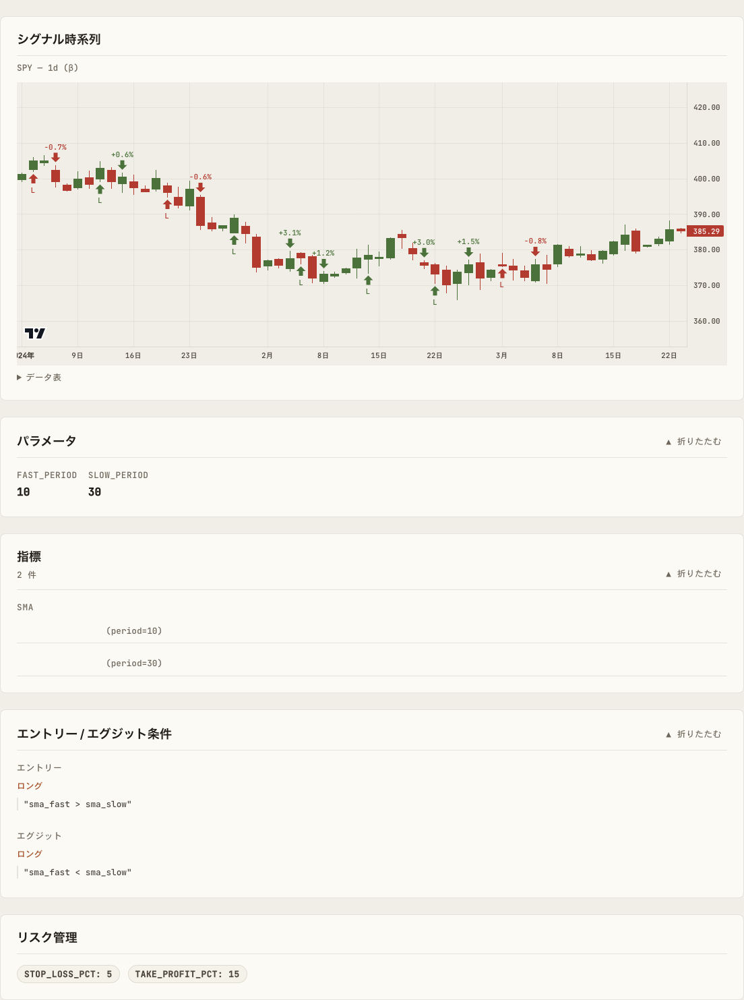
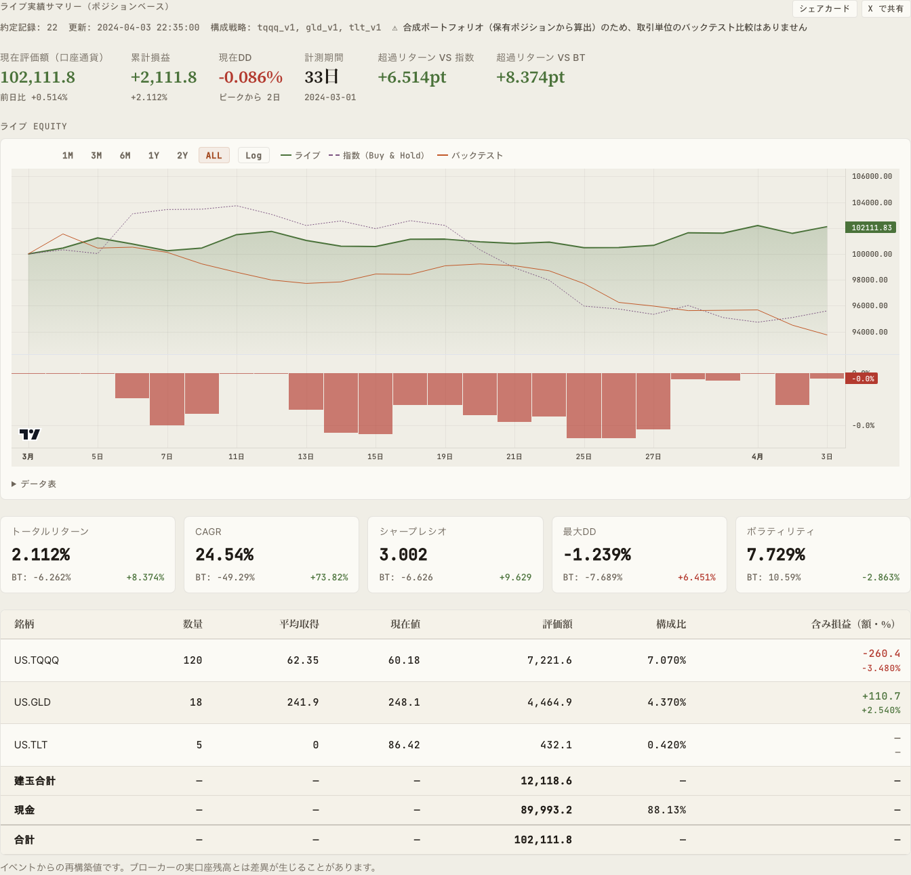
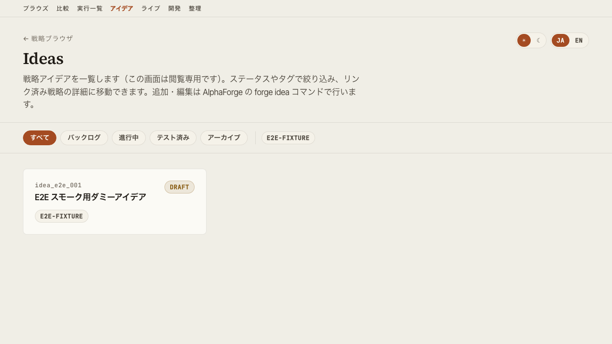
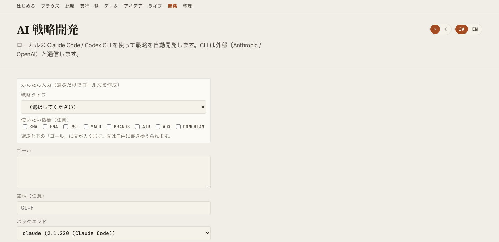

# alpha-visualizer

[](https://pypi.org/project/alpha-visualizer/)
[](https://github.com/alforge-labs/alpha-visualizer/actions/workflows/ci.yml)
[](https://pypi.org/project/alpha-visualizer/)
[](LICENSE)
[](https://x.com/Alforge_bot)

[English](README.en.md) | **日本語**

> **[AlphaForge](https://alforgelabs.com) のバックテスト結果を Web ブラウザで可視化するスタンドアロンツール** — JSON で戦略を記述し、Optuna TPE で最適化、ウォークフォワード検証して TradingView Pine v6 にエクスポート。AI エージェントがパイプライン全体を駆動できる、ローカルファースト Quant CLI です。→ **[AlphaForge を無料で試す](https://alforgelabs.com)**

`alpha-visualizer` は、[AlphaForge](https://alforgelabs.com/) のバックテストエンジンが出力する `backtest_results.db`（SQLite）と戦略 JSON を直接読み取り、ブラウザベースのダッシュボードとして可視化します。`alpha-vis serve` 一発で FastAPI + React SPA が起動し、戦略の閲覧・比較・最適化結果の確認・ライブ実績との突き合わせまでを行えます。

> **0.3.0 で破壊的変更**: コマンド名を `vis` → `alpha-vis` にリネームしました。macOS 標準の `/usr/bin/vis`（BSD 系テキスト可視化ユーティリティ）と衝突して、旧 `vis serve` コマンドが `vis: serve: No such file or directory` などになる初学者の詰まりを解消するためです。詳細は [CHANGELOG](CHANGELOG.md) を参照してください。



## 主な機能

- **Browse** — 戦略ライブラリの一覧と検索（Symbol Coverage / Saved Views / Strategy Ledger）
- **Detail** — Equity / Drawdown / 取引履歴・ベンチマーク（alpha / beta / IR / Correlation）
- **Compare** — 複数戦略の指標比較と相関ヒートマップ
- **Optimize** — WFO 合成エクイティカーブ・Grid 最適化結果の可視化
- **Live** — バックテストとライブ実績の期間整合 diff
- **Ideas** — 探索アイデアの一覧（ステータス・タグフィルタ）
- **Data** — 保有ヒストリカルデータの一覧・鮮度表示（「要更新」バッジ）に加え、GUI からの取得・一括差分更新（進捗表示・キャンセル対応）
- **Maintenance** — 孤児バックテスト結果（strategies.db に定義の無い実行結果）の一覧・選択削除
- **Develop（AI 戦略開発）** — ゴールを入力するとローカルの Claude Code / Codex CLI が戦略を自動開発（詳細は下記）
- **テーマ切替** — ダーク/ライトモード、日英バイリンガル UI
- **エクスポート** — CSV / PNG エクスポート、SNS シェアカード（equity curve＋主要指標入り OGP サイズ PNG）、URL 共有（Browse の selectedId / compareIds 同期）

## クイックスタート

### インストール

```bash
# uv（推奨）
uv pip install alpha-visualizer

# pip
pip install alpha-visualizer
```

### まず同梱サンプルで試す（AlphaForge 不要）

AlphaForge をまだ持っていなくても、同梱の合成サンプルデータで全画面を 1 コマンドで試せます:

```bash
alpha-vis serve --use-bundled-samples
```

40 件のバックテスト結果・WFO / Grid 最適化結果・戦略アイデアを含む自己完結の forge プロジェクト（完全合成データ・再配布フリー）が開きます。内訳は [samples/README.md](samples/README.md) を参照してください。

### 起動

```bash
# AlphaForge の作業ディレクトリで（backtest_results.db / strategies/ がある場所）
alpha-vis serve

# パスを明示する場合
alpha-vis serve --forge-dir /path/to/alpha-strategies

# ポート・ホスト指定
alpha-vis serve --port 9000 --host 0.0.0.0

# ブラウザを自動で開かない
alpha-vis serve --no-open
```

ブラウザで **http://127.0.0.1:8000** が開きます。`Ctrl+C` で停止します。

### 環境変数

| 変数名 | 役割 |
|---|---|
| `FORGE_CONFIG` | `forge.yaml` への絶対パス。**`--forge-dir` 引数より優先される**（探索順序: 引数 `config_path` → `FORGE_CONFIG` → `<forge_dir>/forge.yaml`） |
| `VITE_API_PROXY` | フロント開発サーバーの API proxy 先（既定 `http://127.0.0.1:8000`） |
| `ALPHA_VIS_RUN_TIMEOUT` | `POST /api/run`（バックテスト再実行）の forge CLI タイムアウト秒数（既定 `600`） |
| `ALPHA_VIS_JOB_TIMEOUT` | 非同期ジョブ（`POST /api/jobs`、optimize / WFT / backtest）のタイムアウト秒数（既定 `3600`） |
| `ALPHA_VIS_JOB_CONCURRENCY` | 非同期ジョブの同時実行数（既定 `1`。バックテストエンジンは CPU 集約のため増やす場合は注意） |

開発時に予期せぬ `forge.yaml` が参照されている場合は `unset FORGE_CONFIG` で解除してください。手元で `alpha-vis serve --forge-dir /path/to/A` を打ったのに別ディレクトリの DB が読まれているときは、ほぼこの環境変数が原因です。

## AI 戦略開発（Agent Develop）

GUI の「開発」ビュー（`/develop`）にゴール文（自由記述）・対象銘柄（任意）・バックエンド（Claude Code / Codex CLI）を入力すると、ローカルにインストール済みの `claude` / `codex` CLI をヘッドレスで起動し、戦略 JSON の作成 → `alpha-forge backtest run` による検証 → 完了後に新戦略へのリンク表示、までを自動実行します。

> **⚠️ 外部通信について**: 本機能はユーザー自身の `claude` / `codex` CLI をそのまま起動します。これらの CLI は Anthropic / OpenAI と通信します。alpha-visualizer 自体は API キーの入力・保存・送信を一切行いません。

**権限モデル**

- claude バックエンドはツール許可リスト（`--permission-mode dontAsk` + `--allowedTools "Read(//<workspace>/**),Edit(//<workspace>/**),Glob,Grep,Bash(alpha-forge *)"`）と作業ディレクトリ固定・プロンプト指示によって forge ワークスペース内に留まるよう制約します。読み書きはワークスペース配下のパスにスコープされ、範囲外の操作は自動的に拒否されます（`Edit` ルールは Write を含むファイル編集ツール全体に適用されます）。ただしこれは CLI の許可判定であって OS レベルのサンドボックスではありません。一方 codex バックエンドは `--sandbox workspace-write` という OS レベルのサンドボックスでファイルアクセスを制限します
- シェルコマンドは `alpha-forge` のみ許可されます。エージェントが起動するプロセスには `FORGE_NONINTERACTIVE=1` が継承されるため、alpha-forge 側の破壊的操作の確認プロンプトは自動的に確認済みとして扱われます（ワークスペース内で完結する操作を前提とした設計上の許容です）
- 非 loopback バインド（`alpha-vis serve --host 0.0.0.0` 等）で起動している場合、この機能自体が無効化されます（LAN 越しに任意コード実行に近い操作をされないようにするため）

**前提条件**

- `claude`（Claude Code）または `codex`（Codex CLI）が PATH にあり、認証済みであること
- `alpha-forge` が導入済みであること
- **codex バックエンドの既知の制約**: `--sandbox workspace-write` はネットワークを遮断するため、未キャッシュ銘柄の価格データ取得ができません（実測: DNS 解決の段階で失敗）。対象銘柄で事前に一度バックテストを実行してデータをキャッシュしておくか、claude バックエンドを使ってください（claude 側はエージェントのツール実行に制限を課しますが、alpha-forge CLI 自体の通信までは遮断しません）

**環境変数**

| 変数名 | 役割 |
|---|---|
| `ALPHA_VIS_AGENT_TIMEOUT` | エージェントジョブのタイムアウト秒数（既定 `1800`）。ハング時はプロセスツリーごと kill してジョブを失敗扱いにする |
| `ALPHA_VIS_AGENT_MAX_TURNS` | ターン上限の既定値（既定 `100`・claude のみ）。開発ビューの「ターン上限」欄で 1 実行ごとに上書きできる（最大 `500`） |

**ターン上限について**

claude バックエンドはターン数の上限に達すると、作業の途中でもそこで打ち切られます（`--max-turns`）。既定値は 1 ターンあたり約 17 秒という実測から、タイムアウト（既定 1800 秒）とおよそ釣り合う `100` にしています。バックテストを何度も回して改善するような探索的なゴールでは上限に達しやすいため、その場合は開発ビューの「ターン上限（任意）」に大きめの値を入れるか、ゴールをより小さく分けてください。上限で打ち切られた場合はその旨がエラーとして表示されます（生成途中のファイルはワークスペースに残ります）。

## スクリーンショット

| Detail | Compare |
|---|---|
|  |  |

**Compare — 戦略間相関ヒートマップ**



| Optimize | Strategy 構造 |
|---|---|
|  |  |

| Live（バックテスト×ライブ実績 diff） | Ideas（探索アイデアボード） |
|---|---|
|  |  |

**Develop — AI 戦略開発**



## 困ったときは

`alpha-vis: command not found`・`backtest_results.db` が見つからない・ポート衝突など、よくある詰まりの回答は公式 FAQ にまとまっています。

- **FAQ・トラブルシューティング**: <https://alforgelabs.com/ja/docs/alpha-visualizer/faq/>
- 解決しない場合は [GitHub Issues](https://github.com/alforge-labs/alpha-visualizer/issues) へどうぞ

## ドキュメント

- **公式ドキュメント**: <https://alforgelabs.com/ja/docs/alpha-visualizer/>
- **開発に参加**: [CONTRIBUTING.md](CONTRIBUTING.md)
- **セキュリティ報告**: [SECURITY.md](SECURITY.md)
- **行動規範**: [CODE_OF_CONDUCT.md](CODE_OF_CONDUCT.md)（Contributor Covenant v2.1）
- **変更履歴**: [CHANGELOG.md](CHANGELOG.md)
- **サードパーティライセンス**: [THIRDPARTY_LICENSES.txt](THIRDPARTY_LICENSES.txt)

## 関連プロジェクト

- [Alforge Labs](https://alforgelabs.com/) — AlphaForge 公式サイト・チュートリアル
- [AlphaForge](https://alforgelabs.com/ja/docs/) — バックテストエンジン本体（商用ライセンス）

## 開発環境

```bash
# 依存関係インストール
uv sync

# テスト・Lint
uv run pytest tests/ -v
uv run ruff check src/ tests/

# フロントエンド開発サーバー（ホットリロード）
cd frontend && pnpm install && pnpm run dev

# フロントエンドビルド（src/alpha_visualizer/static/ に出力）
cd frontend && pnpm run build
```

詳細は [CONTRIBUTING.md](CONTRIBUTING.md) を参照してください。

## ライセンス

[Apache License 2.0](LICENSE) © [alforge-labs](https://github.com/alforge-labs)
